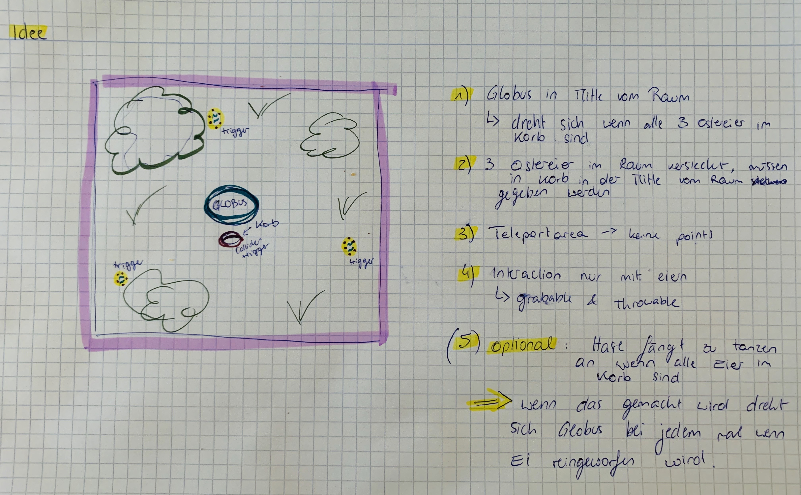
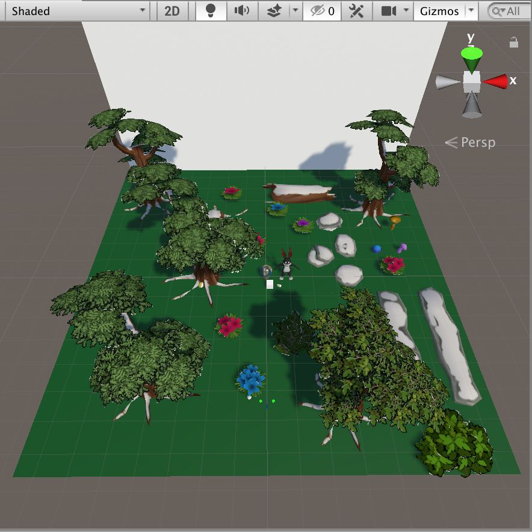
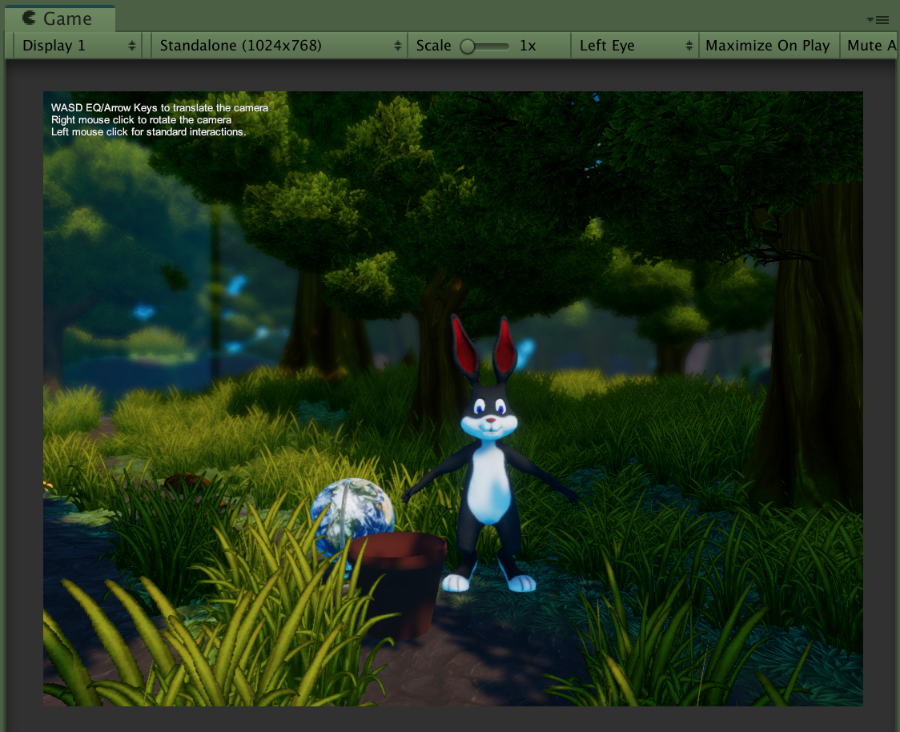

# VRProject-ahagenstein

### Project description: 
you have to collect all the eggs hidden in the scene and put it in a basket in the middle of the scene. The middle of the scene is also marked with a globe. Collect all the eggs and win the game! 

### Development platform:
- macOS Catalina Version 10.15.1 
- Unity Version: 2019.1.14f1
- Visual Studio Code Version: 1.30.2
- Scripting Runtime Version: .NET 4.x Equivalent
- API Compatibility Level: .NET 2.0

### Target platform:
VR Oculus Rift / HTC Vive

### Visuals:
* Idea  	  

* Intermediate result 

* Final

### Necessary setup/execution steps: 
/

### Third party material:

* Globe
https://assetstore.unity.com/packages/3d/props/interior/school-globe-152072

* Rabbit
https://assetstore.unity.com/packages/3d/characters/low-poly-dancing-rabbit-22788

* Eggs
https://poly.google.com/view/47YwSvGeab6

* Basket/ Pot
https://poly.google.com/view/6FTRqXW0feF

* Forest
https://assetstore.unity.com/packages/3d/environments/fantasy/fantasy-forest-environment-free-demo-35361

* Texture Globe
https://www.turbosquid.com/3d-models/earth-max-free/1016431

* Skybox
https://assetstore.unity.com/packages/2d/textures-materials/sky/fantasy-skybox-free-18353

### Project state: 
basically done      
     
     
Link to Planner: https://tasks.office.com/htl-salzburg.ac.at/de-AT/Home/Planner/#/plantaskboard?groupId=ca4dbf91-5ec9-4b4c-b5dd-a4970e2f2e0c&planId=0N-u2G0MeESZk1vCOAe3r5YABexC

     
### Limitations: 
none

### Lessons Learned:   

- plan more time for things you don't really know how to do
- youtube tutorials are your friend
- don't make a concept for a game you can't do just because it sounds cool in your head, after you have finished you can always add more things
- the 2D Debug Mode makes me aggressive 

Copyright by Anna Hagenstein :)

